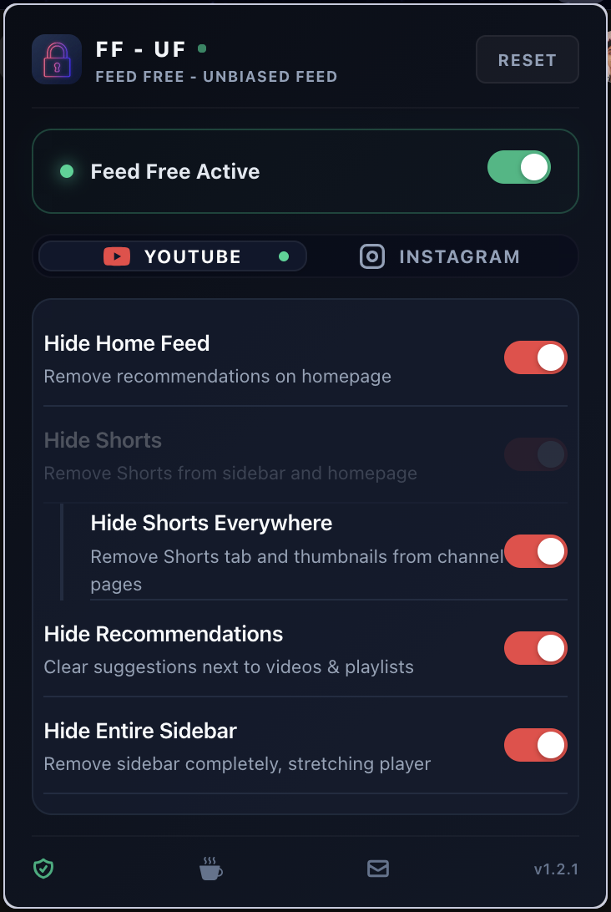
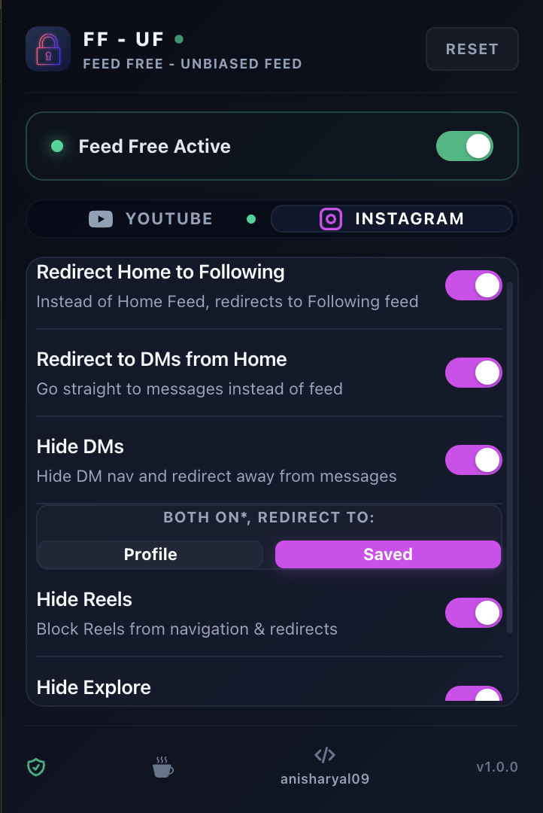

# Feed Free — Unbiased Feed Extension (FF – UF)

Take control of your social media feeds. Block algorithmic recommendations, Shorts, Reels, suggested content, comments, and more on YouTube and Instagram. Works seamlessly with SPA navigation — no page reload required.


<p align="center">
  
  
  <br>
  <em>Screenshots of Popup UI with Youtube and Instagram Controls (Left-to-Right).</em>
</p>

---
> [!NOTE]
> See [CHANGELOG.md](CHANGELOG.md) for detailed version updates and release logs.

## Features

### YouTube
- **Hide Home Feed** — Remove the algorithmic video grid from youtube.com.
- **Hide Shorts** — Remove Shorts from sidebar and homepage.
- **Hide Shorts Everywhere** — Remove Shorts tab and thumbnails from channel pages.
- **Hide Recommendations** — Clear suggested recommendations next to/below the player and playlist pages (leaves playlists visible).
- **Hide Entire Sidebar** — Completely hide the sidebar, stretching the video player to full width.
- **Hide Comments** — Remove the entire comments section.
- **Hide End Screens** — Remove video card overlays at the end of videos.
- **Hide Subscriptions** — Remove Subscriptions link from guide/sidebar.
- **Hide Explore** — Remove Trending/Explore links from guide/sidebar.
- **Hide Report History** — Remove Report History link from guide/sidebar.
- **Hide More from YouTube** — Remove the "More from YouTube" category block from the guide/sidebar.
- **Dynamic Music Mode** — Black out the video player (keep audio playing) with a floating toggle button on the player UI to switch back-and-forth directly, plus an optional screen overlay.
- **Grayscale Mode** — Turn YouTube completely black & white.

### Instagram
- **Following Feed** — Auto-redirect to the Following timeline instead of the algorithmic Home feed.
- **Redirect to DMs** — Go straight to `/direct/inbox/` on open instead of the feed.
- **Hide DMs** — Remove DM navigation and redirect away from the messages inbox.
- **Hide Reels** — Remove Reels from sidebar/navigation menus (keeping profile reels visible) and auto-redirect away from `/reels/`.
- **Hide Explore** — Remove the Explore tab and auto-redirect.
- **Hide Professional Dashboard** — Remove Professional Dashboard link and icon from the sidebar navigation on creator/business profiles.
- **Hide Stories (Home)** — Remove the top stories tray from the home feed.
- **Hide Stories Everywhere** — Completely remove the stories tray, highlights, and story rings (plus auto-redirect from `/stories/`).
- **Square Profile Photos** — Render profile pictures and story rings as soft squares.
- **Hide Notes** — Block status note bubbles from profiles and inbox.
- **Hide Likes** — Remove likes counts on posts, reels, hover cards, and profile page follower counts.
- **Hide Notifications** — Remove notifications tab from sidebar.
- **Hide Comments** — Remove comment sections, comment counts, icons, and input forms from posts/reels.
- **Conflict Resolution** — Choose redirect target (Profile or Saved) when both "Redirect to DMs" and "Hide DMs" are enabled simultaneously.
- **Grayscale Mode** — Turn Instagram completely black & white.

### Global
- **Master toggle** — Enable/disable all blocking at once (Feed Free Active / Inactive)
- **Real-time sync** — Changes apply across all open tabs instantly
- **SPA-proof** — Works through client-side navigation without requiring a page reload
- **Firefox + Chrome** — Supports both browsers from the same codebase

---

## Installation

### Chrome / Chromium
```bash
npm install
npm run build:chrome
```
Load `dist/chrome/` as an unpacked extension at `chrome://extensions` (enable Developer mode first).

### Firefox
```bash
npm install
npm run build:firefox
```
Load `dist/firefox/manifest.json` via `about:debugging` → This Firefox → Load Temporary Add-on.

---

## Development

```bash
npm run dev               # Chrome dev server with HMR (load dist/chrome/)
npm run dev:firefox       # Firefox dev server
npm run dev:reload        # Chrome watch build (manual reload)
npm run build             # Build both Chrome + Firefox
npm run typecheck         # TypeScript check
npm test                  # Run tests
```

---

## Tech Stack

| Layer | Technology |
|---|---|
| Runtime | Chrome MV3 / Firefox MV3 |
| Bundler | Vite 6 + CRXJS Vite Plugin |
| UI | React 19 + Zustand 5 |
| Styling | Tailwind CSS v4 |
| Language | TypeScript 5 |

---

## Project Structure

```
src/
├── background/
│   └── index.ts            # Service worker (storage initialization)
├── bootstrap/
│   └── antiflicker.ts      # document_start anti-flicker script
├── config/
│   ├── defaults.ts         # Default state values & version configs
│   └── selectors.ts        # CSS element-blocking selectors
├── content/
│   ├── shared/
│   │   ├── injector.ts     # Style element injector helper
│   │   └── patron.ts       # URL polling & observer for SPA navigation
│   ├── youtube/
│   │   ├── index.ts        # YouTube content script main logic
│   │   └── rules.ts        # YouTube-specific CSS selectors/rules
│   └── instagram/
│       ├── index.ts        # Instagram content script main logic
│       └── rules.ts        # Instagram-specific CSS selectors/rules
├── popup/
│   ├── components/
│   │   ├── InstagramPanel.tsx # Instagram toggle panel
│   │   ├── YouTubePanel.tsx   # YouTube toggle panel
│   │   ├── Row.tsx            # Standard setting toggle row component
│   │   └── Toggle.tsx         # Reusable toggle switch UI component
│   ├── PopupApp.tsx        # Main Popup React application
│   ├── index.html          # Popup HTML entry point
│   ├── index.tsx           # Popup React mounting logic
│   ├── popup.css           # Styling for the Popup UI
│   └── store.ts            # Zustand store for state sync
├── types/
│   └── index.ts            # TypeScript type definitions
└── utils/
    └── storage.ts          # chrome.storage.local wrapper & listeners

manifest.json               # Chrome manifest (MV3)
vite.config.ts              # Vite build config (dynamically builds Firefox manifest)
```

---

## How It Works

### Semantic CSS Selectors
Social media platforms (especially Instagram) use obfuscated, dynamically generated CSS classes that change frequently with code updates. To maintain durability and prevent breaks, Feed Free targets stable structural selectors—such as tag names, attribute selectors (e.g. `a[href^="/reels"]`), and ARIA labels (e.g. `svg[aria-label="Reels"]`)—rather than raw CSS class names.

### CSS Injection
Uses dynamic `<style>` tag element injection appended directly to the `document.documentElement`. This ensures maximum compatibility across browser platforms (Chrome and Firefox) and handles CSS updates natively in isolated MV3 worlds without requiring page reloads. 

### State Management
Three-layer sync for reliability:
1. **Message broadcasting** — Popup sends state directly to all matching content scripts via `chrome.tabs.sendMessage`
2. **Storage change listener** — `chrome.storage.onChanged` catches cross-tab updates instantly
3. **Polling fallback** — Content scripts poll `chrome.storage.local` every 2 seconds via `setInterval` (catches cases where message delivery fails)

### SPA Navigation Detection
`DOMPatron` uses a `MutationObserver` mapped strictly to URL changes to instantly detect SPA navigations. We deliberately decouple the observer trigger from our CSS style injections to prevent infinite mutation loops while guaranteeing zero-delay instant filtering, even when returning to an idle tab.

### Anti-Flicker
A `document_start` content script (`bootstrap/antiflicker.ts`) loads the saved state synchronously and injects a `<style>` block to hide feed elements **before the page renders**. The main content script removes this style once it takes over with the dynamically injected style tag.

### Heartbeat Recovery
A 3-second `setInterval` in each content script periodically re-applies CSS rules. This catches edge cases where page scripts override or flush the injected stylesheet.

---

## Troubleshooting

> [!IMPORTANT]
> **Extension Not Working?**  
> For any issue with the extension not working or functioning correctly:
>
>**Force reload** the webpage (YouTube/Instagram). If it still doesn't work after this, kindly report the issue.

---

## Support & Feedback

If you encounter bugs, have feature suggestions, or want to share feedback:
> **Email**: Contact us at [email address](mailto:anish.creations.hq@gmail.com?subject=[Feed%20Free%20Extension]%20Support%20/%20Feedback). Please keep the prefilled subject line intact.
>
> **Site**: You can also contact me directly via [anisharyal09.com.np](https://anisharyal09.com.np/#contact) (for any support, features or bugs)


---

## Roadmap

### Phase 2 — The Unified Unbiased Engine *(Core Feature)*
The main upcoming feature is a shared data engine that feeds unmanipulated, randomly discovered, or educational content to both platforms, creating a custom Unbiased Feed!
- **YouTube Injection**: Pull unbiased random videos/shorts into a custom or home feed.
- **Instagram Side-Injection**: Inject insta reels randomly if possible by any means (or cross-platform random YouTube Shorts) directly into the Instagram interface, else any other platform resources (like wikipedia random content).
- **Architecture Designed for Expansion**: The engine's data pipeline will feed into any supported platform beyond YouTube and Instagram.

### Phase 3 — The Lock *(Behavioral Control)*
Add intentional friction to your social media usage for a true digital detox.

> *Note: These are just a basic theoretical outline. Features may be reimagined or changed entirely as development continues. (Open to new ideas and suggestions!)*

## Privacy

Feed Free - Unbiased Feed (FF-UF) is built with privacy in mind. It operates entirely locally in your browser and does not collect, store, or transmit any user data. See the detailed [PRIVACY.md](PRIVACY.md) policy for more information.

---

## License

MIT
